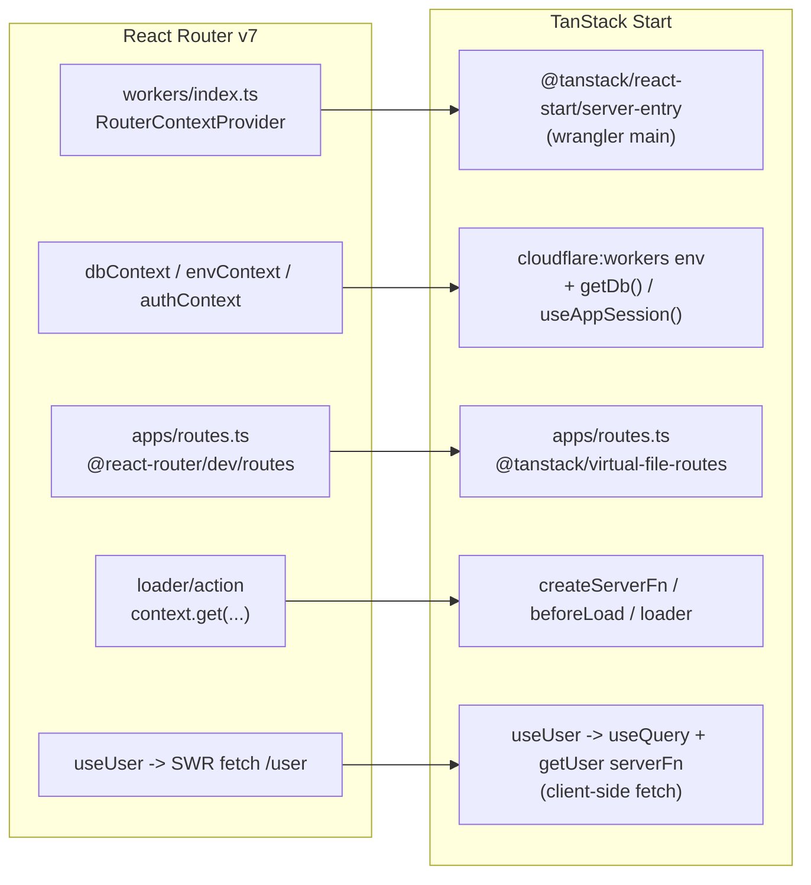

## Goal

Replace React Router v7 framework mode with TanStack Start while:

- Keeping Cloudflare Workers + D1 (Drizzle) as the runtime/deployment target.
- Driving routing from a virtual file route config (`apps/routes.ts`) via `@tanstack/virtual-file-routes`, mirroring today's structure.
- Converting loaders/actions into idiomatic `createServerFn` + route loaders, and the SWR `/user` fetch into a client-side TanStack Query backed by a `getUser` server function (so HTML stays cacheable).

## Architecture mapping (RR v7 -> TanStack Start)




Key replacements:

- `RouterContextProvider` + `dbContext`/`envContext` -> access `env` from `cloudflare:workers`; a `getDb()` helper builds `drizzle(env.DB, { schema })` on the server.
- `authContext` + `createCookieSessionStorage` -> `useSession` from `@tanstack/react-start/server` wrapped in `useAppSession()/updateAppSession()/clearAppSession()` helpers (uses existing `SESSION_COOKIE_SECRET`, must be 32+ chars).
- RR `loader`/`action` -> `createServerFn`; route protection -> `beforeLoad`.
- SWR `useUser` + `/user` JSON route -> `getUser` `createServerFn` (an RPC endpoint callable from the client) consumed by `useUser()` = `useQuery({ queryKey: ["user"], queryFn: getUser })`. User data is fetched on the client after hydration, so page HTML carries no user-specific data and remains cacheable. The dedicated `/user` route is removed (the server fn replaces it).
- `webhook` and `emails/sent` stay as API/server routes (no UI) implemented with TanStack server route handlers.

## Decisions (defaults taken)

- User data fetched client-side via `@tanstack/react-query` + a `getUser` server function. Deliberately NOT loaded in a route loader/SSR so page HTML stays cacheable and user-specific data hydrates on the client (matches the current SWR behavior, just idiomatic). A shared `QueryClient` is provided at the root.
- Dead `Link`s to nonexistent routes (`/docs`, `/features`, `/getting-started`, `/contact`) -> convert to plain `<a>` to satisfy typed routing.
- Keep `apps` as the source/routes directory to minimize file moves.

## Routing config (`apps/routes.ts`)

Rewrite using `@tanstack/virtual-file-routes` (paths relative to routes dir `apps`):

```ts
import { rootRoute, route, index, layout } from "@tanstack/virtual-file-routes"

export const routes = rootRoute("root.tsx", [
  layout("content-layout", "content/routes/layout.tsx", [
    index("content/routes/home.tsx"),
    route("/privacy", "content/routes/privacy.tsx"),
    route("/terms-and-conditions", "content/routes/terms-and-conditions.tsx"),
  ]),
  route("/login", "auth/routes/login.tsx"),
  route("/logout", "auth/routes/logout.tsx"),
  route("/payments/success", "payments/routes/success.tsx"),
  route("/payments/webhook", "payments/routes/webhook.ts"),
  route("/emails/sent", "email/routes/sent.ts"),
])
```

Wire it through `tanstackStart()` (virtualRouteConfig + routesDirectory `apps`, generatedRouteTree e.g. `apps/routeTree.gen.ts`).

## Config / tooling changes

- [vite.config.ts](vite.config.ts): replace `reactRouter()` with `tanstackStart({...})` + `@vitejs/plugin-react`; keep `cloudflare({ viteEnvironment: { name: "ssr" } })` placed BEFORE `tanstackStart()`, plus `tailwindcss()` and `tsconfigPaths()`. Keep the VITEST/storybook guards.
- [wrangler.json](wrangler.json): set `"main": "@tanstack/react-start/server-entry"`, bump `compatibility_date`, keep `nodejs_compat`, keep D1 bindings/envs; adjust `assets` per cloudflare vite plugin output.
- Delete [react-router.config.ts](react-router.config.ts) and [workers/index.ts](workers/index.ts).
- [package.json](package.json): remove `react-router`, `@react-router/dev`, `swr`; add `@tanstack/react-start`, `@tanstack/react-router`, `@tanstack/virtual-file-routes`, `@vitejs/plugin-react` (+ optional `@tanstack/react-router-devtools`). Update scripts: `dev`/`build`/`preview`/`deploy` and drop `react-router typegen` from `check:types`/`setup` (route tree is generated by the plugin).
- [tsconfig.json](tsconfig.json): drop `.react-router/types` from include/rootDirs; ensure `apps/routeTree.gen.ts` is included; keep `@/*` paths.

## Core app shell

- `apps/root.tsx` -> TanStack root route (`createRootRoute`): move `<html>`/`<head>` shell into root component using `HeadContent` + `Scripts`; move meta/links into `head: () => ({ meta, links })`; `ErrorBoundary` -> `errorComponent` (reuse `ErrorPage`); wrap the app in `QueryClientProvider`. No user/session loading server-side (keeps HTML cacheable). Remove `authMiddleware` root middleware.
- Create `apps/router.tsx` (`createRouter` + register types): instantiate a shared `QueryClient` and integrate it with the router (e.g. `routerWithQueryClient` / context), so `useUser`'s `useQuery` works everywhere. Remove/replace [apps/entry.client.tsx](apps/entry.client.tsx) and [apps/entry.server.tsx](apps/entry.server.tsx) (Start provides the server entry; add a client entry only if needed for custom hydration).

## Server primitives

- New `apps/core/db.server.ts` (or similar): `getDb()` using `env` from `cloudflare:workers`.
- Rework [apps/auth/session.server.ts](apps/auth/session.server.ts): `useAppSession()/updateAppSession()/clearAppSession()` via `useSession`, with explicit `cookie.secure` set from env to avoid the known Safari/dev cookie issue.
- Delete [apps/auth/context.ts](apps/auth/context.ts), [apps/auth/middleware.server.ts](apps/auth/middleware.server.ts), [apps/core/context.ts](apps/core/context.ts), [packages/db/context.ts](packages/db/context.ts), and [packages/types/router.ts](packages/types/router.ts) (RR context types).
- Update [apps/auth/auth.server.ts](apps/auth/auth.server.ts) `requireUserId` to read the session directly and `throw redirect(...)` from `@tanstack/react-router`.

## Route conversions

- `login` ([apps/auth/routes/login.tsx](apps/auth/routes/login.tsx)): loader (`redirect` if already logged in) + the multi-step OTP `action` -> `createServerFn({ method: "POST" })`; replace RR `<Form>`/`useNavigation`/`actionData` with a server-fn mutation driving local component state.
- `logout` ([apps/auth/routes/logout.tsx](apps/auth/routes/logout.tsx)): action -> `createServerFn` that clears session and redirects.
- `user` ([apps/user/routes/user.tsx](apps/user/routes/user.tsx)) + [apps/user/use-user.ts](apps/user/use-user.ts): remove the dedicated route; add a `getUser` `createServerFn` (reads session via `useAppSession`, looks up the user). Reimplement `useUser()` as `useQuery({ queryKey: ["user"], queryFn: () => getUser() })` (client-side fetch, preserves SWR-like ergonomics). After login/logout, call `queryClient.invalidateQueries({ queryKey: ["user"] })`. Consumers [apps/content/routes/layout.tsx](apps/content/routes/layout.tsx) and [apps/payments/components/checkout-button/checkout-button.tsx](apps/payments/components/checkout-button/checkout-button.tsx) keep using `useUser()` with minimal change.
- `payments/webhook` ([apps/payments/routes/webhook.tsx](apps/payments/routes/webhook.tsx)) + [apps/payments/handlers.server.ts](apps/payments/handlers.server.ts): convert to a TanStack server route POST handler; handlers take `db`/`env` directly instead of `context`.
- `payments/success` ([apps/payments/routes/success.tsx](apps/payments/routes/success.tsx)): static page; swap `react-router` `Link` for `@tanstack/react-router` `Link`.
- `emails/sent` ([apps/email/routes/sent.ts](apps/email/routes/sent.ts)): convert to a server route GET; gate on PROD.
- Content pages (home/privacy/terms): swap `react-router` imports for `@tanstack/react-router`; convert dead `Link`s to `<a>`.

## Tests

- Rewrite [apps/payments/routes/webhook.test.ts](apps/payments/routes/webhook.test.ts): drop `RouterContextProvider`/`context.get` shape; call the new webhook handler / handlers with injected `db`/`env`.
- Audit DOM tests that render components using `useUser` (e.g. header): wrap with a `QueryClientProvider` (and mock `getUser`) since the hook now uses `useQuery`.
- e2e: [e2e/auth.spec.ts](e2e/auth.spec.ts) still fetches `/emails/sent` (kept). Verify selectors/flow against the rewritten login UI; confirm `playwright.config.ts` `vite preview`/`dev` commands still serve on :3000.

## Risks / watch items

- Cloudflare D1 binding access pattern (`cloudflare:workers` env) and Start's Cloudflare build output (assets dir, wrangler `main`) must line up; validate with `bun run dev` and a `build`.
- Login UX is the most involved conversion (multi-step OTP state previously carried by RR `actionData`).
- Typed routing will flag links to nonexistent routes; handled by converting them to `<a>`.
- `useSession` cookie `secure` flag in dev (known issue) — set explicitly.

## Validation

Run `bun run check`, `bun run check:types`, `bun run test`, then `bun run dev` smoke + `bun run test:e2e`.

Docs: TanStack Start Cloudflare hosting ([https://tanstack.com/start/latest/docs/framework/react/guide/hosting](https://tanstack.com/start/latest/docs/framework/react/guide/hosting)), Virtual File Routes ([https://tanstack.com/router/latest/docs/routing/virtual-file-routes](https://tanstack.com/router/latest/docs/routing/virtual-file-routes)), Authentication/sessions ([https://tanstack.com/start/latest/docs/framework/react/guide/authentication](https://tanstack.com/start/latest/docs/framework/react/guide/authentication)).